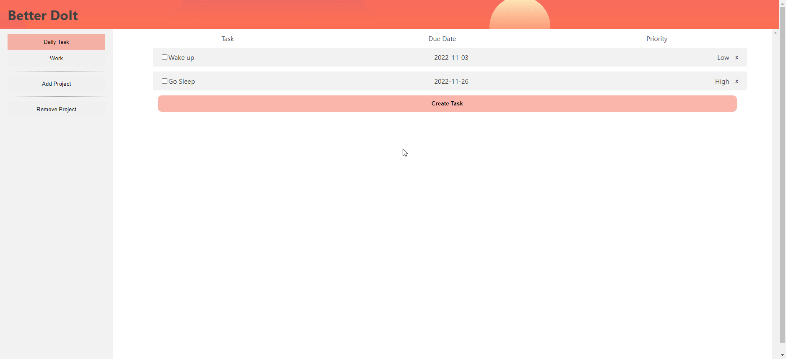

**Better DoIt**

This project is part of The Odin Project Javascript curriculum. This project allows users to keep track of tasks with custom project folders and notes, stored in their local storage.

The primary focus of this project is to gain familiarity with the use of LocalStorage and React.

**Technologies:**

- Simple HTML, CSS, and JavaScript
- React
- LocalStorage
- SCSS

**Features:**

- Create, view, and delete tasks with a name, due date, priority and additional notes
- Create, and delete project folders to sort out tasks
- Ability to edit tasks
- All created items will be stored in the users local storage, able to access on window close and refresh
- Check off completed tasks

**Demo GIF**

